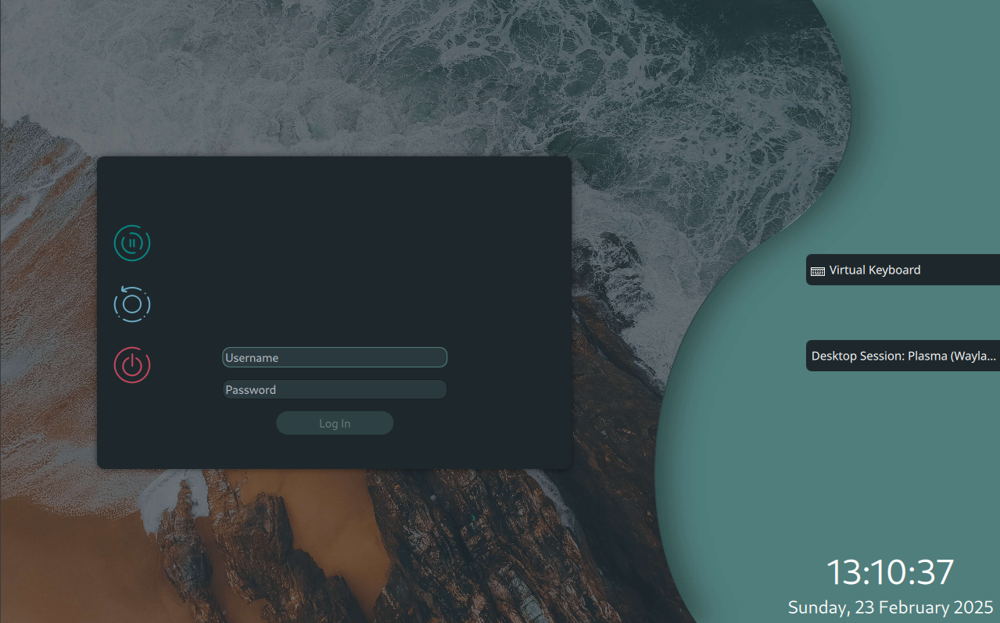

# Radarch Archlive
**Custom Archiso maker for Radarch Linux**

This repository contains the script collection based on official archiso package, which allows you to build your own Radarch Linux ISO. It contains the packages list, custom install script, various KDE Plasma Look and Feel theme and other customization elements, Plasma 6 Plasmoids and various configuration files related to sddm, wayland and other core utilities to allow you to build a fully functioning Radarch Live ISO.  

It also features a custom Radarch Install script, and an interactive GUI installer to install Radarch Linux (or vanilla Arch Linux) to install the distribution easily. The GUI installer displays the commands that your selection options would run on split screen to help you with the process of installing Radarch (or simply Arch Linux) efficiently.

Internet connection is still required even with the packages being embedded in the ISO. This is a deliberate decision as we want the installation to be a learning experience. 
## Features

- Custom Install script embedded in the ISO.
- Interactive GUI Installer which teaches you on installing Radarch (and Arch Linux) through the command line.
- Complete live environment supporting all the custom themes, plasmoids and applications shipped with Radarch Linux.
- Custom archiso creation script for various configs


## Requirements

You need to have archiso installed on your system be able to use this.

If you are already using ArchLinux, or any other Arch based distribution, you can install it with `sudo pacman -S archiso`.

If you are using any other Linux distribution, you can use distrobox to bootstrap a minimal ArchLinux installation and cloning this repository inside.

For Windows, you can install Archlinux inside of WSL and clone this repo inside.

## Building your ISO

You need to have archiso installed in your system to use this script, and a working internet connection to pull the packages to install to the ISO live environment. 

To build the ISO, open a terminal in the project directory and run:

```
sudo mkarchiso -v -w /path/to/output/dir .
```
For more details on how this works, refer to [archiso wiki page](https://wiki.archlinux.org/title/Archiso).
## Screenshots




## Tools and configs used
- [Archiso](https://wiki.archlinux.org/title/Archiso)
- [Ant Dark Plasma Theme by Eliverlara](https://store.kde.org/p/1464321)
- [Avdan Win 11 10 Concept Ksplash by Regenerate38](https://store.kde.org/p/1394200)


## Acknowledgements

 - [Eliverlara](https://store.kde.org/u/eliverlara)
 - [Official ArchLinux Wiki](https://wiki.archlinux.org)

